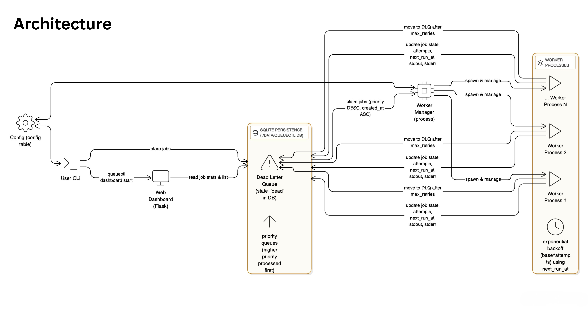

# QueueCTL — CLI Job Queue

A production-grade CLI-based background job queue system with persistent storage, automatic retries, exponential backoff, and dead letter queue support.

## Features

- Enqueue and manage background jobs via CLI
- Multiple worker processes for parallel job execution
- Automatic retry with exponential backoff
- Dead Letter Queue (DLQ) for failed jobs
- SQLite persistence across restarts
- Configurable retry limits and backoff parameters
- Job priority queues (higher priority jobs processed first)
- Scheduled/delayed jobs (run_at)
- Job output logging (stdout/stderr stored in database)
- Web dashboard for real-time monitoring
- Cross-platform support (Linux, macOS, Windows)

## Requirements

- Python 3.11 or higher
- Required packages (see requirements.txt):
  - typer>=0.9.0
  - rich>=13.0.0
  - pytest>=7.4.0
  - flask>=2.3.0

## Installation

1. Clone the repository and navigate to the project directory

2. Create a conda environment:
```bash
conda create -n queuectl-env python=3.11
conda activate queuectl-env
```

Alternatively, if you prefer using a virtual environment:
```bash
python -m venv venv
source venv/bin/activate  # On Windows: venv\Scripts\activate
```

3. Install dependencies:
```bash
pip install -r requirements.txt
```

4. Install the package in editable mode:
```bash
pip install -e .
```

## Database Initialization

Before using QueueCTL, initialize the database:

```bash
queuectl init-db
```

This creates the SQLite database at `./data/queuectl.db` with the required schema.

## Usage Examples

### Enqueue Jobs

Enqueue a job using JSON:
```bash
queuectl enqueue '{"id":"email-notification-001","command":"python3 -c \"import time; time.sleep(2); print(\\\"Email sent\\\")\""}'
```

Enqueue a job using command-line flags:
```bash
queuectl enqueue --command "python3 -c \"import time; time.sleep(2); print('Data processing completed')\"" --id data-process-001 --max-retries 3
```

Enqueue a job with priority (higher number = higher priority):
```bash
queuectl enqueue --command "python3 -c \"print('Urgent payment processing')\"" --id payment-urgent-001 --priority 10
```

Schedule a job for future execution:
```bash
queuectl enqueue --command "python3 -c \"print('Scheduled backup completed')\"" --run-at "2025-11-05T15:00:00Z"
```

### Start and Stop Workers

Start workers (default: 1 worker):
```bash
queuectl worker start --count 3
```

Stop workers gracefully:
```bash
queuectl worker stop
```

### View Queue Status

Check overall queue status:
```bash
queuectl status
```

Example output:
```
Queue Status:
  Pending: 5
  Processing: 2
  Completed: 10
  Failed: 0
  Dead (DLQ): 1

Worker Status:
  Manager: Running
  Active workers: 3
```

### List Jobs

List all jobs:
```bash
queuectl list
```

List jobs by state:
```bash
queuectl list --state pending
queuectl list --state completed
```

List with pagination:
```bash
queuectl list --state pending --limit 20 --offset 0
```

### View Job Details

View detailed information about a specific job including execution output:
```bash
queuectl show email-notification-001
```

This displays:
- Job metadata (ID, command, state, attempts, timestamps)
- Exit code and error messages (if any)
- STDOUT (standard output from successful jobs)
- STDERR (standard error from failed jobs)

### Dead Letter Queue (DLQ)

List jobs in DLQ:
```bash
queuectl dlq list
```

Retry a job from DLQ:
```bash
queuectl dlq retry failed-process-001
```

Retry with updated max retries:
```bash
queuectl dlq retry failed-process-001 --max-retries 5
```

### Configuration

Set configuration values (supports both hyphen and underscore formats):
```bash
queuectl config set max-retries 5
queuectl config set max_retries 5
queuectl config set backoff-base 2
queuectl config set worker-poll-interval 1
```

Get configuration values:
```bash
queuectl config get max-retries
queuectl config get max_retries
```

Available config keys:
- `max_retries`: Default maximum retry attempts (default: 3)
- `backoff_base`: Base for exponential backoff calculation (default: 2)
- `worker_poll_interval`: Worker polling interval in seconds (default: 1)
- `db_path`: Database file path (default: ./data/queuectl.db)

### Web Dashboard

Start the web dashboard for monitoring:
```bash
queuectl dashboard start
```

Access the dashboard at `http://127.0.0.1:5000` (default)

Customize host and port:
```bash
queuectl dashboard start --host 0.0.0.0 --port 8080
```

The dashboard provides:
- Real-time job statistics (pending, processing, completed, failed, dead)
- Job list with state, priority, attempts, and timestamps
- Auto-refresh option (every 5 seconds)
- Clean, responsive web interface

## Architecture Overview

QueueCTL uses a manager-worker process model with SQLite for persistence:

1. **CLI Layer**: Provides command-line interface for all operations
2. **SQLite Persistence**: Stores jobs and configuration in `./data/queuectl.db`
3. **Worker Manager**: Spawns and manages multiple worker processes
4. **Worker Processes**: Claim and execute jobs atomically using transactions (priority-based ordering)
5. **Executor**: Runs shell commands via subprocess with OS detection (5-minute timeout)
6. **Dead Letter Queue**: Stores jobs that exceed retry limits
7. **Web Dashboard**: Flask-based web interface for real-time monitoring (optional bonus feature)
8. **Job Output Logging**: Stores stdout/stderr in database for job execution history (optional bonus feature)

### System Architecture Diagram



### Job States

Jobs transition through the following states:
- `pending`: Waiting to be processed
- `processing`: Currently being executed by a worker
- `completed`: Successfully finished
- `failed`: Failed but will retry
- `dead`: Exhausted retries, moved to DLQ

### Retry Logic

Failed jobs are retried with exponential backoff:
- Delay formula: `delay_seconds = backoff_base ** attempts`
- Example with base=2: attempt 1 → 2s, attempt 2 → 4s, attempt 3 → 8s
- Jobs move to DLQ when `attempts >= max_retries`

### Atomic Job Claiming

Workers use SQLite transactions with IMMEDIATE locking to prevent duplicate job processing. Only one worker can claim a specific job at any time.

## Assumptions & Trade-offs

### Storage Choice
- **SQLite**: Chosen for simplicity, reliability, and cross-platform support. Suitable for moderate workloads on a single machine. For distributed systems, consider PostgreSQL or Redis.

### Backoff Formula
- **Exponential (base^attempts)**: Prevents overwhelming downstream services. Configurable base allows tuning retry aggressiveness.

### Concurrency Model
- **Multiprocessing**: Uses Python's multiprocessing for true parallelism. Workers are separate processes to avoid GIL limitations.

### Command Execution
- **Shell=True**: Commands execute in shell for maximum flexibility. Security note: Only run trusted commands as shell injection is possible.

### Cross-Platform Support
- Commands are executed as-is without translation. Platform-specific commands (e.g., `sleep` on Linux, `timeout` on Windows) must be adapted by the user or use cross-platform alternatives like Python commands.

## Testing

Run the test suite:
```bash
pytest tests/ -v
```

Run specific test:
```bash
pytest tests/test_enqueue_complete.py -v
```

Run the validation script:
```bash
chmod +x scripts/validate_core_flows.sh
./scripts/validate_core_flows.sh
```

The validation script tests:
- Database initialization
- Job enqueuing
- Worker start/stop
- Job completion
- Retry and DLQ behavior

For comprehensive manual testing including all edge cases, error handling scenarios, concurrency testing, persistence verification, and bonus feature validation, see `MANUAL_TESTING_GUIDE.md` which contains 19 detailed test scenarios with step-by-step instructions.

## Development

### Project Structure

```
queuectl/
├── queuectl/           # Main package
│   ├── cli.py          # CLI interface (Typer)
│   ├── store.py        # SQLite persistence layer
│   ├── worker.py       # Worker process implementation
│   ├── worker_manager.py # Worker lifecycle management
│   ├── executor.py     # Command execution
│   ├── config.py       # Configuration utilities
│   └── utils.py        # Helper functions
├── tests/              # Test suite
├── scripts/            # Utility scripts
└── data/               # Runtime data (DB, logs, PIDs)
```

### Logging

QueueCTL logs to both console and `./data/queuectl.log`. Log level can be configured via environment variable:

```bash
export QUEUECTL_LOG_LEVEL=DEBUG
```

## Demo

Demo video: [QueueCTL Demo Video](https://drive.google.com/drive/folders/1bq2A2MAGq7n1NGi8UjdfWH2UtAyZFtOA?usp=sharing)

## License

MIT License - See LICENSE file for details
